# Link Archive State Machine Documentation

## Overview

The link archive system implements a GitHub Actions-based state machine that processes URLs into archive entries and then generates weblog posts based on PR review comments.

## State Machine Flow

```mermaid
stateDiagram-v2
    [*] --> Issue_Created: User creates GitHub Issue<br/>with "URL: {url}"
    
    Issue_Created --> Processing: process-url-to-pr.yml<br/>triggered
    Processing --> Archive_Created: Success
    Processing --> Failed: Error
    
    Archive_Created --> PR_Created: Creates PR with<br/>archive file
    PR_Created --> Validation: validate-and-review.yml<br/>runs
    
    Validation --> Ready_For_Review: Validation passes<br/>✅ Label: ready-to-comment<br/>👤 Reviewer assigned
    Validation --> PR_Closed: Validation fails<br/>❌ PR closed
    
    Ready_For_Review --> Reviewing: Owner reviews<br/>and comments
    Reviewing --> Approved: PR approved ✅
    Reviewing --> Changes_Requested: Changes requested
    
    Approved --> Weblog_Generation: create-weblog.yml<br/>triggered by approval<br/>+ ready-to-comment label
    Weblog_Generation --> Weblog_Created: Success
    Weblog_Generation --> Failed: Error
    
    Weblog_Created --> Merged: PR auto-merged<br/>with squash commit
    
    Failed --> [*]: Manual intervention<br/>Error comment on issue
    PR_Closed --> [*]: End
    Changes_Requested --> Ready_For_Review: After fixes
    Merged --> [*]: Complete
```

## States and Transitions

### 1. URL Submission (Issue Creation)
- **Action**: User creates GitHub issue with `URL: <url>` format
- **Trigger**: `process-url-to-pr.yml` workflow dispatch
- **Outputs**: 
  - Success → Archive file created
  - Failure → Error comment posted on issue

### 2. Archive Processing (`archive_processor.py`)
- **Validates**: URL format and accessibility
- **Checks**: Existing archive entries (6-month window)
- **Creates**: `YYYY-MM-DD-slugified-title.md` file
- **Required fields**: title, tags, link, date, description
- **Error handling**:
  - Missing API keys → Clear error message
  - Invalid URL → Validation error
  - Existing entry → Reports existing file

### 3. PR Creation and Validation
- **PR Creation**: 
  - Creates feature branch `archive-YYYY-MM-DD-*`
  - Opens PR with archive file
  - Triggers `validate-and-review.yml` workflow
- **Validation** (`archive_validator.py`):
  - File location (must be in `archive/`)
  - Filename format (`YYYY-MM-DD-*.md`)
  - YAML frontmatter structure
  - Required `link` field with valid URL
- **State changes**:
  - Success → Adds `ready-to-comment` label + assigns reviewer
  - Failure → Closes PR with error comment

### 4. Review State
- **Indicator**: `ready-to-comment` label present
- **Available actions**: 
  - Add line-specific comments (quoted in weblog)
  - Add general PR comments
  - Approve PR
  - Request changes
- **Transitions**:
  - PR approved + has `ready-to-comment` label → Triggers weblog creation
  - Changes requested → Back to review after fixes

### 5. Weblog Generation (`weblog_processor.py`)
- **Trigger**: PR approval event when PR has `ready-to-comment` label
- **Workflow**: `create-weblog.yml`
- **Processes**:
  - Extracts review comments (line-specific and general)
  - Quotes full paragraphs for line comments
  - Filters out generic approvals (LGTM, etc.)
- **Creates**: Weblog entry with:
  - All archive frontmatter fields
  - `type: weblog` marker
  - Link back to archive entry
  - Quoted content with commentary
- **Commits**: Adds weblog file to PR branch
- **Error handling**:
  - Invalid frontmatter → ValueError
  - JSON parsing errors → Logged to stderr

### 6. Final Validation and Merge
- **Validation** (`weblog_validator.py`):
  - Required fields: title, date, link, type
  - Date format: YYYY-MM-DD
  - Link format: `archive/*`
  - Content requirements: 50+ chars, "Archive:" reference
- **Success**: 
  - Posts success comment on PR
  - Auto-merges PR with squash commit
  - Merge message includes weblog file path
- **Failure**: Process stops, manual intervention needed

## Failure States and Recovery

### Clear Failure Indicators
1. **Processing failures**: Error comment on original issue with workflow logs link
2. **Validation failures**: PR closed with specific error message
3. **Weblog generation failures**: stderr output, exit code 1
4. **All Python scripts**: Exit code 1 on any error

### Retry Mechanisms
1. **URL Processing**: 
   - Can re-trigger workflow from issue
   - Cleanup handled automatically on failure
   
2. **Archive Validation**:
   - Fix issues and push to branch
   - Validation re-runs on push
   
3. **Weblog Creation**:
   - Can re-approve PR after fixing issues
   - Comments preserved for retry

### Manual Intervention Points
1. **Missing API keys**: Set in GitHub secrets or .env file
2. **Validation errors**: Fix file format/content
3. **Review required**: Owner must review and approve
4. **Merge conflicts**: Resolve manually